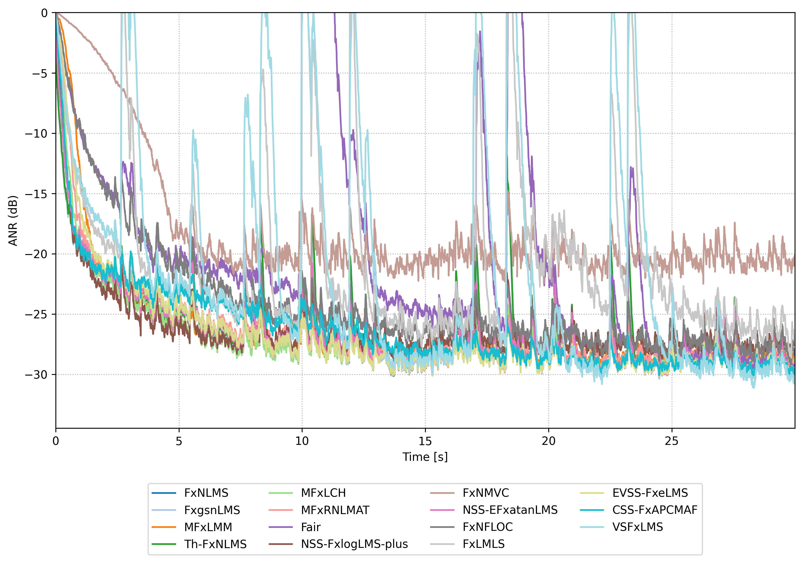

# Feedforward Active Noise Control for Impulsive Noise (Python)

** [matlab version is here!](https://github.com/YosukeSugiura/Active_Noise_Control_for_Impulsive_noise/tree/matlab) **

This repository provides a **Feedforward Active Noise Control (ANC)** simulator for impulsive noise, implemented in **pure Python + NumPy** and accelerated with **Numba**. Multiple robust FxLMS-family algorithms are available and can be selected via `config.json`. Figures and logs are automatically saved under `logs/`.

## System Overview


## Requirements

- Python ≥ 3.10
- See `requirements.txt`:
  - numpy
  - numba
  - matplotlib
  - tqdm

Install:
```bash
pip install -r requirements.txt
```

## Directory Structure

```
.
├─ algorithms/
│   └─ algorithms.py
├─ impulse_response/
│   ├─ primary_ir.dat
│   └─ secondary_ir.dat
├─ sounds/
│   ├─ impulsive_noise_alpha1.45.dat
│   ├─ impulsive_noise_alpha1.65.dat
│   └─ ...
├─ anc.py
├─ config.json
├─ logs/
└─ ffanc.png (optional diagram)
```

## Usage

1. Edit `config.json` to enable/disable algorithms.
2. Specify impulse response paths and noise file.
3. Run:
   ```bash
   python anc.py --config config.json
   ```
4. Output will be stored in `logs/`.

## Algorithms

All algorithm implementations are located in the `algorithms/` directory.

| Abbreviation                                | Description                                                                         | Reference |
| ------------------------------------------- | ----------------------------------------------------------------------------------- | --------- |
| **FxNLMS**                                  | Standard Filtered-x Normalized LMS                                                  | –         |
| **BlockFxNLMS** (a.k.a. NFB-FxLMS, FxBNLMS) | Block-based time-domain FxNLMS                                                      | [1]       |
| **FreqFxNLMS**                              | Block-based delayless frequency-domain FxNLMS                                       | [1]       |
| **FxLMM**                                   | Hampel-type Least Mean M-estimate Filtered-x LMS                                    | [2]       |
| **Th-FxNLMS**                               | Thresholded FxNLMS                                                                  | [3]       |
| **FxlogNLMS**                               | Logarithmic-transformed FxNLMS                                                      | [4]       |
| **Fair**                                    | Fair-type M-estimator adaptive algorithm                                            | [5]       |
| **FxgsnLMS**                                | General Step-size Normalized LMS                                                | [6]       |
| **NS-FxlogLMS**                             | FxlogLMS with Normalized switching                                                  | [7]       |
| **MFxLMM**                                  | Modified MFxLMM                                                                     | [8]       |
| **MFxLCH**                                  | Modified filtered-x least cosine hyperbolic algorithm with low complexity           | [9]       |
| **NSS_EFxatanLMS**                          | EFxatanLMS with normalized switching step size using mixed reference/error power    | [10]      |
| **MFxRNLMAT**                               | Modified Filtered-x Robust Normalized Least Mean Absolute Third Algorithm           | [11]      |
| **NFXtanhLMS**                              | Normalized FxLMS with adjustable hyperbolic-tanh error transform for impulsive noise | [12]      |
| **EVSS_FxeLMS**                             | Filtered-x erf LMS with enhanced variable step-size combining normalization and sine weighting | [13] |
| **FxNFLOC**                                 | Filtered-x Normalized Fractional Lower-Order Covariance                             | [14]      |
| **FxlogNLMS+**                              | Improved FxlogNLMS with stability and speed-up modifications                        | [15]      |
| **CSS_FxAPCMAF**                            | Combined step-size filtered-x affine projection Champernowne adaptive filter (P=1 implementation) | [16] |
| **FxNMVC**                                  | Filtered-x Normalized Maximum Versoria Criterion                                    | [17]      |
| **VSFxLMS**                                 | Variable-λ softsign Filtered-x LMS                                                  | [18]      |


## Config Notes

- To select which algorithms to run, set `enabled: true` for algorithms you want to execute, and `enabled: false` for those you do not want to execute in `config.json`.
- Paths in `config.json` can be **relative** to the config location.
- `amp_scales` enables amplitude invariance tests.
- `order_control` sets control filter length.
- `order_secondary` sets secondary path model FIR length.

## Output Files

- `anr.csv` — ANR history per algorithm
- `ratio_amp_invariance.csv` — steady-state ratio stats (if available)
- `anr.png` — ANR over time
- Timing summary printed to console

## Results

The figure below shows the comparative performance of each algorithm under impulsive noise (α-stable noise with α=1.45).



## Terminal Summary Example

```
=== Summary (last trial) ===
FxNLMS            ANR_mean[dB]= -23.386  update_mean=   5.514 µs
BlockFxNLMS       ANR_mean[dB]= -23.266  update_mean=   6.595 µs
```

## References

[1] S. M. Kuo, S. Mitra, and W. H. Horner,  
"Block implementation of the filtered-x LMS algorithm for active noise control systems,"  
*Journal of Sound and Vibration*, vol. 284, no. 3–5, pp. 681–704, 2005.

[2] T. Thanigai, S. M. Kuo, and R. Yenduri,  
"Nonlinear active noise control for infant incubators in neonatal intensive care units,"  
in *Proc. ICASSP*, 2007, pp. 109–112.

[3] M. T. Akhtar and W. Mitsuhashi,  
"Improved adaptive algorithm for active noise control of impulsive noise,"  
in *Proc. 51st Midwest Symposium on Circuits and Systems (MWSCAS)*, IEEE, pp. 330–333, 2008.

[4] L. Wu, H. He, and X. Qiu,  
"An active impulsive noise control algorithm with logarithmic transformation,"  
*IEEE Trans. Audio, Speech, and Language Processing*, vol. 19, no. 4, pp. 1041–1044, 2011.

[5] L. Wu and X. Qiu,  
"An M-estimator based algorithm for active impulse-like noise control,"  
*Applied Acoustics*, vol. 74, pp. 407–412, 2013.

[6] Y. Zhou, Q. Zhang, and Y. Yin,  
"Active control of impulsive noise with symmetric α-stable distribution based on an improved step-size normalized adaptive algorithm,"  
*Mechanical Systems and Signal Processing*, vol. 56, pp. 320–333, 2015.

[7] M. Pawelczyk, W. Wierzchowski, L. Wu, and X. Qiu,  
"An extension to the filtered-x LMS algorithm with logarithmic transformation,"  
in *Proc. ISSPIT*, 2015, pp. 454–459.

[8] G. Sun, M. T. Li, and T. C. Lim,  
"Enhanced filtered-x least mean M-estimate algorithm for active impulsive noise control,"  
*Applied Acoustics*, vol. 90, pp. 31–41, 2015.

[9] A. Mirza, A. Zeb, M. Y. Umair, et al.,  
"Less complex solutions for active noise control of impulsive noise,"  
*Analog Integrated Circuits and Signal Processing*, vol. 102, no. 3, pp. 507–521, 2020.

[10] F. Gu, S. Chen, Z. Zhou, and Y. Jiang,  
"An enhanced normalized step-size algorithm based on adjustable nonlinear transformation function for active control of impulsive noise,"  
*Applied Acoustics*, vol. 176, 107853, 2021.  
doi:[10.1016/j.apacoust.2020.107853](https://doi.org/10.1016/j.apacoust.2020.107853)

[11] A. Mirza, F. Afzal, A. Zeb, A. Wakeel, W. S. Qureshi, and A. Akgul,  
"New FxLMAT-Based Algorithms for Active Control of Impulsive Noise,"  
*IEEE Access*, vol. 11, pp. 81279–81288, 2023.

[12] C. Li, S. Tian, W. Li, and D. Du,  
"Active Impulsive Noise Control Algorithm Based on Adjustable Hyperbolic Tanh Function,"  
*Circuits, Systems, and Signal Processing*, 2023.  
doi:[10.1007/s00034-023-02374-7](https://doi.org/10.1007/s00034-023-02374-7)

[13] Y. Cheng, C. Li, S. Chen, and Z. Zhou,  
"Enhanced variable step-size filtered-x erf LMS for active impulsive noise control,"  
*Circuits, Systems, and Signal Processing*, 2023.  
doi:[10.1007/s00034-023-02421-3](https://doi.org/10.1007/s00034-023-02421-3)

[14] P. Feng, Z.-y. Wang, and H. C. So,  
"Projection FxLMS framework of active noise control against impulsive noise environments,"  
*Signal Processing*, vol. 225, 109624, 2024.  
doi:[10.1016/j.sigpro.2024.109624](https://doi.org/10.1016/j.sigpro.2024.109624)

[15] A. Haneda, Y. Sugiura, and T. Shimamura,  
"FxlogLMS+: Modified FxlogLMS Algorithm for Active Impulsive Noise Control,"  
*Lecture Notes in Electrical Engineering*, vol. 1322, Springer, 2025, pp. 342–351.

[16] S. H. Ryu, J. Park, and P. Park,  
"Novel Active Noise Control Algorithm Based on Combined Step-size Strategy Against Impulsive Noise,"  
*International Journal of Control, Automation, and Systems*, 23(2), 592–599, 2025.  
doi:[10.1007/s12555-024-0507-y](https://doi.org/10.1007/s12555-024-0507-y)

[17] S. Zandi, S. Zhao, E. Cheng, and I. S. Burnett,  
"Filtered-x Normalized Maximum Versoria Criterion Algorithm for Active Impulsive Noise Control," 
in *Proc. ICSV31*, July 2025.

[18] Pucha Song, Haiquan Zhao, Yingying Zhu, Shaohui Lv, and Gang Chen,  
"Robust Filtered-x LMS Algorithm Based on Adjustable Softsign Framework for Active Impulsive Noise Control," 
*Symmetry*, vol. 17, no. 10, 1592, pp. 1–16, Sep. 2025.  
doi:[10.3390/sym17101592](https://doi.org/10.3390/sym17101592)


## Author

Yosuke Sugiura (Saitama University, Japan)
